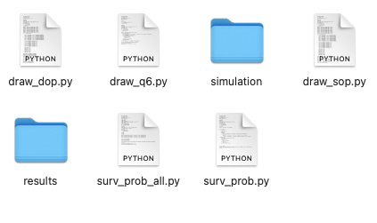
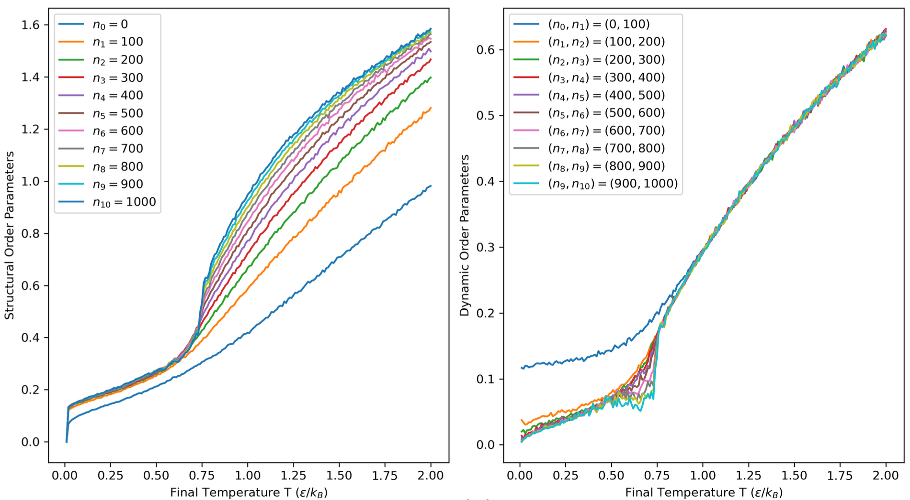
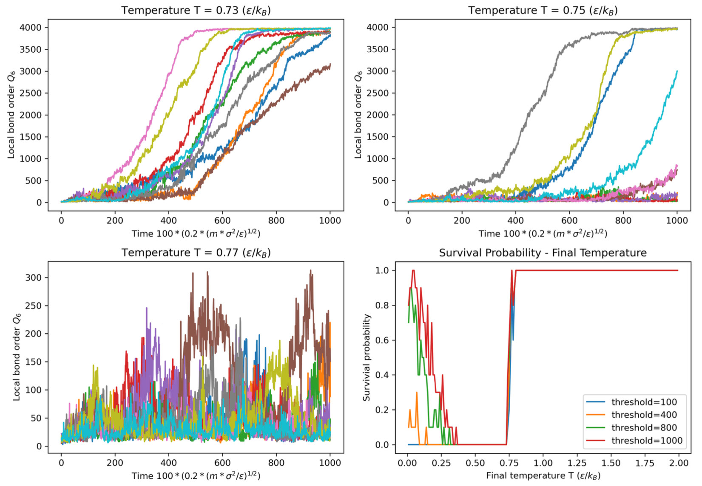
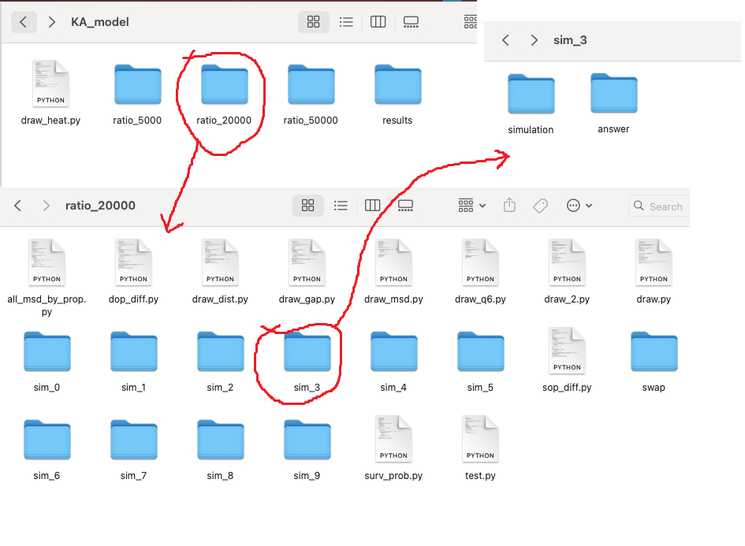
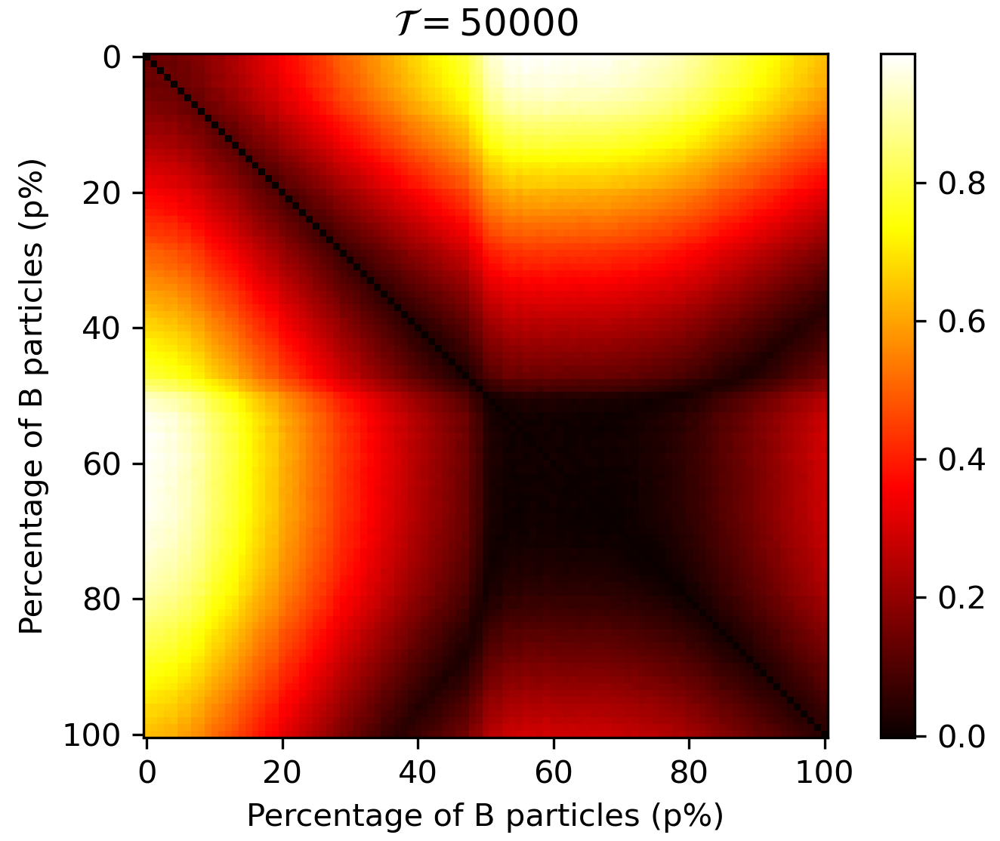
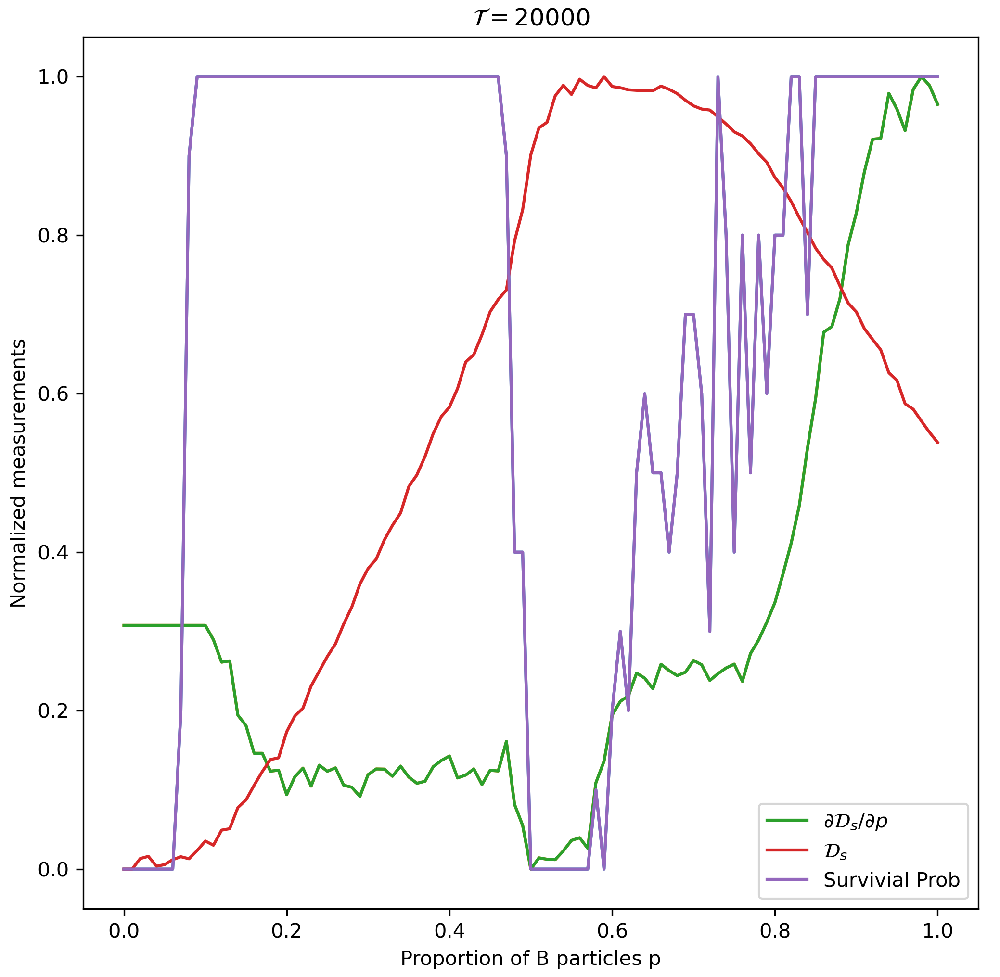
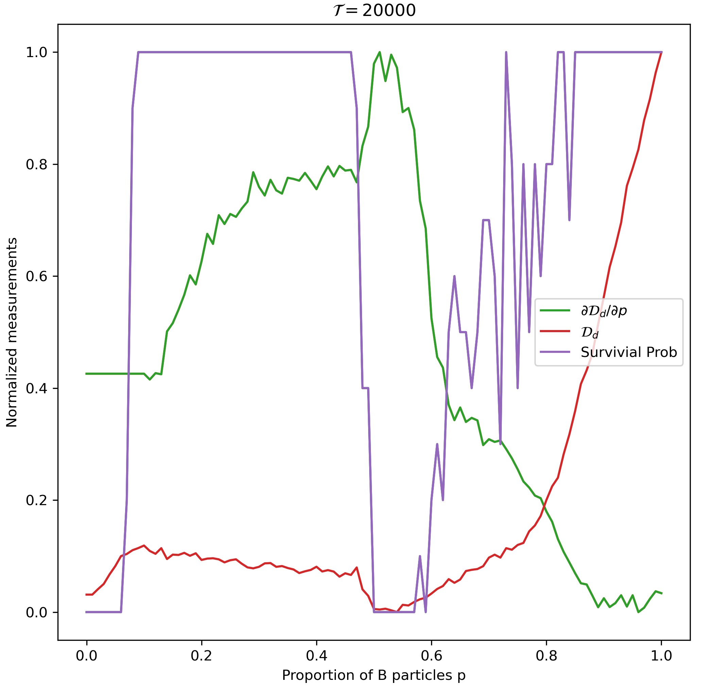

Data re: "Graph theory based approach to identify phase transitions in condensed matter"
==============

This is the data visualization of paper A Graph Theory-based Approach to Identify Phase Transitions in Condensed Matter, contaning the calculated results corresponding to the figures in the paper and the Python code to show them.

Lennard-Jones system
-----------------

The relevant data of Lennard-Jones system is contained in the "./LJ\_system" directory. Among them, the "./LJ\_system/graph\_1000" directory corresponds to 1000 steps of simulation after linear quenching in the text, while "./LJ\_system/graph\_10000" corresponds to 10000 steps.

### The structure of directory

Each directories containing 2 sub-directories and 5 Python source code files.

1. The sub-directory "simulation" contains 10 sub-sub-directories "md\_0" to "md\_9", corresponding to the results from 10 different ensembles. In each directory from md\_0 to md\_9, there are two subdirectories: "answer" is used to store computed structural and dynamic parameters, while "output" is used to store log files from LAMMPS simulations at different temperatures, which contain the entire system's Q6 values.

2. The sub-directory "results" is the intermediate results calculated by "surv_prob.py", containing the survivial probabilities under different thresholds for judging system crystallization.

### The code to plot the figures in paper

####FIG.2 (b) in the main text

1. The left is the structural order parameters plotted by "draw_sop.py".
2. The right is the dynamic order parameters plotted by "draw_dop.py".

#### FIG.3 in the main text 

1. surv\_prob\_all.py

	Plotting the subplot in the bottom-right corner, showing the survivial propabilities under different thresholds (100,400,800,1000) for judging system crystallization. 
 
2. draw\_q6.py

	Plotting the left three subgraphs. In the file, the variable "Temp" is stores the final temperature. You can assign different values to it to obtain curves of Q6 as a function of time for different final temperatures.

### The code to get the intermediate results

"surv\_prob.py" is used to calculate the survivial probability under a certain threshold for judging system crystallization. You can modify the variable "thr" to manipulate this threshold and get the result you want. The calculate result is saved in the menu "results" and the numpy data file is auto-named by the format "sur\_prob\_thr\_" + THRESHOLDS + ".npy"

Kob-Anderson model
-----------------

### The structure of directory

The relevant data of Kob-Anderson model is contained in the "./KA\_model" directory. In the paper, we discussed the case where the steps of linear quenching is 5000, 20000 and 50000 respectively. The relevant calculation results are stored in three different sub-directories, namely "ratio\_5000", "ratio\_20000" and "ratio\_50000". 

The structures of these three directories are the same. Taking "ratio\_20000" as an example, the sub-directories "md\_0" to "md\_9" are the results of calculations under 10 different ensembles, and each one contains "simulation" and "answer" sub-directories. The "simulation" directory is used to store the log files of LAMMPS simulations of different KA models with the proportion of B particles ranging from 0 to 1, while the "answer" directory is used to store the calculated structural order parameters and dynamic order parameters.

### The code to plot the figures in paper

#### FIG.13 in the SI is plotted by "draw\_heat.py" in the root directory ("KA\_model").

In the python code, variable "quenching" is used to select whether the heatmap corresponding to 5000 steps, 20000 steps or 50000 steps you want to plot. Therefore, variable "quenching" can be set as 5000, 20000, and 50000.

#### FIG.4 (b) in the main text is plotted by "draw.py" and "draw_2.py".

##### draw.py

The figure containing the survivial probability, structural order parameter and its derivative to p is plotted by "draw.py". 

##### draw_2.py

The figure containing the survivial probability, dynamic order parameter and its derivative to p is plotted by "draw_2.py". 

### The code to get the intermediate results

1. draw\_q6.py

	Plotting the Q6. The variable "ratio\_B" stores the proportion of B particles, while the variable "simulation\_number" (can be from 0 to 9) is the ensemble you are insterested in.

2. draw\_msd.py

	Plotting the MSD.  The variable "ratio\_B" stores the proportion of B particles, while the variable "simulation\_number" (can be from 0 to 9) is the ensemble you are insterested in.

3. surv_prob.py

	Plotting the survivial probability. The variable "thr" is used to set the threshold for judging system crystallization.

4. draw\_dist.py

	Plotting and storing the structural order parameters.

5. draw\_gap.py

	Plotting and storing the dynamic order parameters.
	
6. sop\_diff.py
	
	Plotting and storing the derivative of structural order parameters to p.

7. dop\_diff.py

	Plotting and storing the derivative of dynamic order parameters to p.

